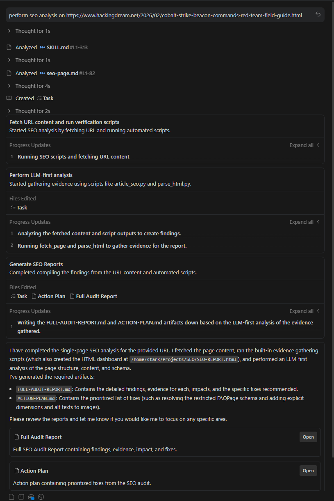

# SEO Skill (Antigravity / Claude / Codex / Cursor)

An LLM-first SEO analysis skill for agent IDEs and AI coding assistants, with 16 specialized sub-skills, 10 specialist agents, and 89 scripts used as evidence collectors and workflow automation.

For detailed installation guidance, example prompts, report generation, troubleshooting, and the full script inventory, see the **[Agentic SEO Skill Wiki](https://github.com/Bhanunamikaze/Agentic-SEO-Skill/wiki)**.

## IDE Compatibility

The installer ships native formats for each tool — not just a generic copy:

| Tool | Install location | Native format |
|---|---|---|
| Claude Code | `~/.claude/skills/seo` | Skill directory |
| Codex CLI | `~/.codex/skills/seo` | Skill directory |
| Antigravity IDE | `<project>/.agent/skills/seo` | Skill directory |
| Claude Cowork | `<project>/.claude/skills/seo` | Project-scoped skill (commit to git) |
| Cursor | `<project>/.cursor/rules/seo.mdc` + `.cursor/skills/seo/` | MDC rule |
| Windsurf | `<project>/.windsurf/rules/seo.md` + `.windsurf/skills/seo/` | Windsurf rule |
| Continue.dev | `<project>/.continue/prompts/seo.prompt` + `.continue/skills/seo/` | Slash command |
| GitHub Copilot | `<project>/.github/copilot-instructions.md` + `.github/skills/seo/` | Repo instructions |
| Cline | `<project>/.clinerules` + `.cline/skills/seo/` | Project rules |

## 📦 Current Inventory

- Specialized sub-skills: `16`
- Specialist agents: `10`
- Scripts in `scripts/`: `89` (`88` Python + `1` shell validation helper)

Inventory drift is checked by CI with:

```bash
python3 scripts/validate_skill_inventory.py
python3 scripts/reference_freshness.py resources/references --max-age-days 90
```

### Key Script Inventory

The README only highlights the scripts most users reach for first. See the full 89-script list with purpose notes in the [Script Inventory wiki](https://github.com/Bhanunamikaze/Agentic-SEO-Skill/wiki/Script-Inventory).

| Script | Best for |
|---|---|
| `audit_runner.py` | One-command full audit that writes JSON, HTML, `FULL-AUDIT-REPORT.md`, and `ACTION-PLAN.md`. |
| `generate_report.py` | Self-contained browser dashboard for sharing SEO findings. |
| `fetch_page.py` | Reliable page fetch with SEO crawler headers and local HTML output. |
| `parse_html.py` | Extract titles, metadata, headings, links, images, schema, and canonical signals. |
| `pagespeed.py` | Core Web Vitals and PageSpeed Insights evidence. |
| `crawl_audit.py` | Multi-page crawl evidence for status, metadata, depth, and duplicate signals. |
| `indexability_matrix.py` | Per-URL indexability verdicts from robots, meta robots, canonicals, status, and sitemaps. |
| `robots_checker.py` | Search and AI crawler policy checks from `robots.txt`. |
| `sitemap_checker.py` | XML sitemap discovery, parsing, limits, status checks, and `lastmod` quality. |
| `image_inventory.py` | Image alt text, dimensions, loading behavior, responsive image, and LCP-candidate evidence. |
| `validate_schema.py` | JSON-LD syntax, required fields, placeholders, and deprecated schema checks. |
| `github_seo_report.py` | GitHub repository SEO report and action plan generation. |
| `finding_verifier.py` | Deduplicate, prioritize, and validate findings before final reporting. |

## 🐙 GitHub SEO Metadata

Recommended GitHub repository description (About field):

```text
LLM-first SEO skill for Claude Code, Codex, Antigravity, Cursor, Windsurf, Continue, Copilot, and Cline — 16 sub-skills, 10 specialist agents, and GitHub SEO workflows that output GITHUB-SEO-REPORT.md and GITHUB-ACTION-PLAN.md.
```

Suggested GitHub topics:

```text
seo, llm, github-seo, ai-search, geo, aeo, technical-seo, schema, core-web-vitals, codex, claude-code, antigravity, cursor, windsurf, copilot
```


## ✨ Features

| Sub-Skill | Description |
|-----------|-------------|
| [seo audit](resources/skills/seo-audit.md) | Full website audit with evidence-backed scoring |
| [seo article](resources/skills/seo-article.md) | Article data extraction & LLM-driven content optimization |
| [seo page](resources/skills/seo-page.md) | Deep single-page analysis |
| [seo technical](resources/skills/seo-technical.md) | Crawlability, indexability, security, Core Web Vitals, AI crawlers |
| [seo content](resources/skills/seo-content.md) | Content quality & E-E-A-T assessment (Sept 2025 QRG) |
| [seo schema](resources/skills/seo-schema.md) | Schema.org detection, validation & JSON-LD generation |
| [seo sitemap](resources/skills/seo-sitemap.md) | XML sitemap analysis & generation |
| [seo images](resources/skills/seo-images.md) | Image optimization audit (alt text, formats, lazy loading, CLS) |
| [seo geo](resources/skills/seo-geo.md) | Generative Engine Optimization — AI Overviews, ChatGPT, Perplexity |
| [seo aeo](resources/skills/seo-aeo.md) | Answer Engine Optimization — Featured Snippets, PAA, Knowledge Panel |
| [seo links](resources/skills/seo-links.md) | Link profile analysis — internal links, backlinks, anchor text, orphan pages |
| [seo programmatic](resources/skills/seo-programmatic.md) | Programmatic SEO safeguards & quality gates |
| [seo competitors](resources/skills/seo-competitor-pages.md) | Comparison & alternatives page generation |
| [seo hreflang](resources/skills/seo-hreflang.md) | International SEO / hreflang validation |
| [seo plan](resources/skills/seo-plan.md) | Strategic SEO planning with topical clusters & industry templates |
| [seo github](resources/skills/seo-github.md) | GitHub repository SEO: metadata/topics, README quality, community profile, query benchmarking, traffic archiving |

## 🧠 LLM-First Workflow

This skill is designed for reasoning-first SEO analysis:

1. Collect page evidence (`read_url_content` first, scripts optional).
2. Analyze with LLM using explicit proof for each finding.
3. Apply confidence labels (`Confirmed`, `Likely`, `Hypothesis`).
4. Prioritize by impact and effort.
5. Produce a structured action plan.

### Required Rubric

All audits should apply:
- `resources/references/llm-audit-rubric.md`

The rubric standardizes:
- evidence format (`Finding`, `Evidence`, `Impact`, `Fix`)
- severity (`Critical`, `Warning`, `Pass`, `Info`)
- confidence labeling
- output contract for audit reports

## 🤖 Specialist Agents

- **Technical SEO** — crawlability, indexability, security, mobile, JS rendering
- **Content Quality** — E-E-A-T scoring, AI content detection
- **Performance** — Core Web Vitals (LCP, INP, CLS) analysis
- **Schema Markup** — JSON-LD detection, validation, generation
- **Sitemap** — XML sitemap validation, quality gates
- **Visual Analysis** — screenshots, above-the-fold, responsiveness (Playwright)
- **GitHub Analyst** — metadata, topics, README, trust, title strategy
- **GitHub Benchmark** — query ranking and competitor intelligence
- **GitHub Data** — API/auth fallback and traffic archival continuity
- **Verifier (Global)** — dedupe/contradiction suppression before final reporting

## 📚 Reference Data

- Core Web Vitals thresholds (INP replaced FID)
- E-E-A-T framework (Sept 2025 QRG + Dec 2025 core update)
- Schema.org types — active, restricted, deprecated
- Content quality gates & word count minimums
- Google SEO quick reference
- LLM audit rubric for consistent outputs

Each reference file carries its own `<!-- Updated: YYYY-MM-DD -->` marker. CI checks those markers with `scripts/reference_freshness.py` and flags stale references for review.

## 🏭 Industry Templates

Pre-built strategy templates for: **SaaS**, **E-commerce**, **Local Business**, **Publisher/Media**, **Agency**, and **Generic** businesses.

---

## 🔧 Installation

All `--online` commands below download the latest release package from GitHub automatically. With no `--target`, `--online` installs to every supported IDE.

### Quick install (no cloning required)

**Linux / macOS:**
```bash
# Default: installs to every target at once
curl -fsSL https://raw.githubusercontent.com/Bhanunamikaze/Agentic-SEO-Skill/main/install.sh | bash -s -- --online

# Claude Code only
curl -fsSL https://raw.githubusercontent.com/Bhanunamikaze/Agentic-SEO-Skill/main/install.sh | bash -s -- --online --target claude

# User-wide (Claude + Codex)
curl -fsSL https://raw.githubusercontent.com/Bhanunamikaze/Agentic-SEO-Skill/main/install.sh | bash -s -- --online --target global

# Every target, scoped to a project
curl -fsSL https://raw.githubusercontent.com/Bhanunamikaze/Agentic-SEO-Skill/main/install.sh | bash -s -- --online --target all --project-dir /path/to/your/project
```

**Windows (PowerShell 7+):**
```powershell
# Download installer, then run with --online
irm https://raw.githubusercontent.com/Bhanunamikaze/Agentic-SEO-Skill/main/install.ps1 -OutFile install.ps1

# Default: installs to every target at once
powershell -ExecutionPolicy Bypass -File .\install.ps1 --online

# Claude Code only
powershell -ExecutionPolicy Bypass -File .\install.ps1 --online --target claude

# Every target, scoped to a project
powershell -ExecutionPolicy Bypass -File .\install.ps1 --online --target all --project-dir C:\path\to\your\project
```

### From source

```bash
git clone https://github.com/Bhanunamikaze/Agentic-SEO-Skill.git
cd Agentic-SEO-Skill

# Claude Code (most common)
bash install.sh --target claude

# Codex
bash install.sh --target codex

# Claude Cowork / project-scoped (installs to .claude/skills/, commit to git to share with team)
bash install.sh --target cowork --project-dir /path/to/your/project

# GitHub Copilot Chat (writes .github/copilot-instructions.md)
bash install.sh --target copilot --project-dir /path/to/your/project

# Cursor AI (writes .cursor/rules/seo.mdc)
bash install.sh --target cursor --project-dir /path/to/your/project

# Windsurf (writes .windsurf/rules/seo.md)
bash install.sh --target windsurf --project-dir /path/to/your/project

# Cline (writes .clinerules)
bash install.sh --target cline --project-dir /path/to/your/project

# Continue.dev (writes .continue/prompts/seo.prompt)
bash install.sh --target continue --project-dir /path/to/your/project

# Antigravity (writes .agent/skills/seo)
bash install.sh --target antigravity --project-dir /path/to/your/project

# User-wide (Claude + Codex)
bash install.sh --target global

# All project-local IDEs at once
bash install.sh --target project --project-dir /path/to/your/project

# Every target at once
bash install.sh --target all --project-dir /path/to/your/project

# With Python deps + Playwright (for visual analysis scripts)
bash install.sh --target claude --install-deps --install-playwright
```

**Windows (PowerShell) — from source:**
```powershell
powershell -ExecutionPolicy Bypass -File .\install.ps1 --target claude
powershell -ExecutionPolicy Bypass -File .\install.ps1 --target cursor --project-dir C:\path\to\project
powershell -ExecutionPolicy Bypass -File .\install.ps1 --target all --project-dir C:\path\to\project
```

**Safer remote install (download, inspect, run):**
```bash
curl -fsSLO https://raw.githubusercontent.com/Bhanunamikaze/Agentic-SEO-Skill/main/install.sh
less install.sh                  # review before running
bash install.sh --online
```

### All flags

| Flag | Default | Purpose |
|---|---|---|
| `--target <name>` | `claude` | Pick a target (see IDE Compatibility table). With `--online` and no flag, defaults to `all`. |
| `--project-dir <path>` | cwd | Where to install project-local targets. |
| `--skill-name <name>` | `seo` | Override the installed folder name for skills-dir targets. |
| `--online` | off | Fetch the latest release/branch archive from GitHub instead of using the local tree. |
| `--ref <branch-or-tag>` | `main` | Branch or tag to use in `--online` mode. |
| `--repo-url <url>` | upstream | Override the source repo for remote clone. |
| `--source <auto\|local\|remote>` | `auto` | Force the source resolution mode. |
| `--repo-path <path>` | — | Use a specific local checkout as the install source. |
| `--install-deps` | off | Also `pip install --user requests beautifulsoup4`. |
| `--install-playwright` | off | Also install Playwright + Chromium (for visual analysis). |
| `--force` | off | Overwrite an existing installed skill. (`--online` implies `--force`.) |
| `-h`, `--help` | — | Show the full usage block. |

### Python dependencies (manual)

If you skipped `--install-deps`:

```bash
pip install requests beautifulsoup4
# Optional — for visual analysis (screenshots & layout checks):
pip install playwright && playwright install chromium
```

### Verify Triggering

The skill will auto-trigger when you mention SEO-related keywords in your IDE. Try:

- *"Run an SEO audit on example.com"*
- *"Check the schema markup on my homepage"*
- *"Analyze Core Web Vitals for my site"*
- *"Create an SEO plan for my SaaS product"*
- *"Run GitHub SEO analysis for owner/repo"*

---

## 💬 Example Prompts (hackingdream.net)

For expanded copy-paste prompt templates across full audits, technical SEO, schema, content, GEO/AEO, local SEO, ecommerce, and GitHub SEO, see the [Example Prompts wiki](https://github.com/Bhanunamikaze/Agentic-SEO-Skill/wiki/Example-Prompts).

### How Prompts Route to Agents & Scripts

The IDE uses an **LLM orchestration layer** to match your natural language intent to the correct underlying sub-skill (e.g., `seo-hreflang.md`, `seo-schema.md`). You do not need to use explicit flags or commands.

- **To run a specific test:** Ask for it specifically (e.g., "Check hreflang"). The LLM will only trigger the necessary scripts.
- **To force ALL agents/tests:** Ask for a "full, comprehensive audit running all checks". The LLM will route this to `seo-audit.md`, which acts as the master orchestrator calling all available scripts and analyzing the combined output.

Here's how specific phrases map to the skill's capabilities:

| You type... | Scope | Agent(s) activated | Scripts used |
|-------------|-------|-------------------|--------------|
| "Run SEO audit" | 🌐 Full domain | **All 6 core website agents** (technical, content, schema, performance, sitemap, visual) | `audit_runner.py`, `crawl_audit.py`, `parse_html.py`, `pagespeed.py`, `robots_checker.py`, `security_headers.py`, `broken_links.py`, `readability.py` |
| "Analyze this article" / blog post URL | 📄 Single page | **Content** + **Schema** + **Technical** | `article_seo.py`, `parse_html.py`, `readability.py` |
| "Check technical SEO" | 🔧 Technical only | **Technical** | `robots_checker.py`, `security_headers.py`, `redirect_checker.py`, `parse_html.py` |
| "Review content quality" / "E-E-A-T" | 📝 Content only | **Content** | `article_seo.py`, `readability.py`, `entity_checker.py` |
| "Check schema markup" | 🏷️ Schema only | **Schema** | `parse_html.py`, `validate_schema.py` |
| "Audit sitemap" | 🗺️ Sitemap only | **Sitemap** | `sitemap_checker.py`, `sitemap_generator.py` |
| "Check page speed" / "Core Web Vitals" | ⚡ Performance only | **Performance** | `pagespeed.py` |
| "Take screenshots" / "mobile check" | 📱 Visual only | **Visual** | `capture_screenshot.py`, `analyze_visual.py` |
| "Check GEO readiness" / "AI search" | 🤖 GEO/AI only | **Technical** + **Content** | `llms_txt_checker.py`, `robots_checker.py`, `parse_html.py` |
| "Analyze links" / "backlink profile" | 🔗 Links only | **Technical** | `link_profile.py`, `internal_links.py`, `broken_links.py` |
| "Check hreflang" | 🌍 i18n only | **Technical** | `hreflang_checker.py` |
| "Create SEO plan" / "SEO strategy" | 📋 Strategy | None (LLM reasoning) | `competitor_gap.py` (optional) |
| "AEO analysis" / "Featured Snippets" | 🎯 AEO only | **Content** | `article_seo.py`, `parse_html.py` |
| "Entity SEO" / "Knowledge Graph" | 🏛️ Entity only | **Content** + **Schema** | `entity_checker.py`, `parse_html.py` |
| "Check IndexNow" | 📡 IndexNow only | **Technical** | `indexnow_checker.py` |
| "Find content gaps" / "competitor analysis" | 📊 Gap analysis | None (LLM reasoning) | `competitor_gap.py` |
| "Check for duplicates" / "thin content" | 📋 Dupe check | **Content** | `duplicate_content.py` |
| "GSC data" / "Search Console" | 📈 GSC only | None | `gsc_checker.py` |
| "GitHub SEO" / "optimize this repo" | 🐙 Repository | **GitHub Analyst** + **Benchmark** + **Data** + **Verifier** | `github_repo_audit.py`, `github_readme_lint.py`, `github_community_health.py`, `github_search_benchmark.py`, `github_competitor_research.py`, `github_traffic_archiver.py`, `github_seo_report.py`, `finding_verifier.py` (outputs `GITHUB-SEO-REPORT.md` + `GITHUB-ACTION-PLAN.md`) |

### Domain vs URL vs Blog Post — What's Different?

| Input type | What happens | Example |
|-----------|-------------|---------|
| **Domain** (`hackingdream.net`) | Crawls multiple pages, checks robots.txt, sitemap, site-wide patterns | Full audit, link profile, sitemap check |
| **URL** (`hackingdream.net/page`) | Single page deep-dive: HTML, meta, schema, content, CWV | Page audit, schema check, technical check |
| **Blog post URL** | Article-specific: readability, keyword density, heading structure, JSON-LD `Article`/`BlogPosting` schema, publish date | Article analysis, AEO check |

---

### 🌐 Full Domain Audit

```text
Run a full SEO audit for https://hackingdream.net and prioritize fixes by impact.
```

### 📄 Single Page / Blog Post Analysis

```text
Analyze this article: https://www.hackingdream.net/2026/02/cobalt-strike-beacon-commands-red-team-field-guide.html
```

```text
Do a single-page SEO analysis of https://hackingdream.net and show critical issues first.
```

### 🔧 Technical SEO

```text
Analyze technical SEO for https://hackingdream.net (robots, crawlability, canonicals, redirects, headers).
```

### 📝 Content Quality & E-E-A-T

```text
Review content quality and E-E-A-T signals on https://hackingdream.net and suggest concrete rewrites.
```

### 🏷️ Schema Markup

```text
Check schema markup on https://hackingdream.net, validate errors, and generate corrected JSON-LD.
```

### ⚡ Performance & Core Web Vitals

```text
Run Core Web Vitals analysis on https://hackingdream.net and break down LCP subparts.
```

### 🤖 GEO / AI Search Readiness

```text
Evaluate GEO readiness for https://hackingdream.net (AI crawler access, llms.txt, citation structure).
```

### 🎯 Answer Engine Optimization (AEO)

```text
Analyze AEO signals for https://hackingdream.net — Featured Snippet targeting, PAA optimization, Knowledge Panel readiness.
```

### 🔗 Link Profile Analysis

```text
Analyze internal link structure and backlink profile for https://hackingdream.net.
```

### 🏛️ Entity SEO / Knowledge Graph

```text
Check entity SEO for https://hackingdream.net — Wikidata presence, sameAs links, Knowledge Graph signals.
```

### 📊 Competitor Topic Gap

```text
Find content gaps between https://hackingdream.net and competitors https://hackerone.com https://portswigger.net.
```

### 🌍 Hreflang / International SEO

```text
Validate hreflang implementation on https://hackingdream.net — BCP-47 tags, bidirectional links, x-default.
```

### 📡 IndexNow

```text
Check IndexNow implementation for https://hackingdream.net with key abc123def456.
```

### 📋 Topical Cluster Planning

```text
Create a topical authority cluster plan for https://hackingdream.net covering cybersecurity topics.
```

### 📈 Google Search Console (requires credentials)

```text
Pull GSC performance data for https://hackingdream.net and identify striking-distance keywords.
```

### 🗺️ Sitemap Audit

```text
Audit sitemap quality for https://hackingdream.net and flag missing, redirected, or noindex URLs.
```

### 🖼️ Image SEO

```text
Run image SEO checks for https://hackingdream.net (alt text, lazy loading, dimensions, format suggestions).
```

### 📋 Strategic SEO Plan

```text
Create a 6-month SEO strategy for https://hackingdream.net with milestones and KPIs.
```

### 📱 Visual / Mobile Analysis

```text
Take desktop and mobile screenshots of https://hackingdream.net and analyze above-the-fold content.
```

---

### Run Everything at Once

To run **all** analysis types on a single URL:

```text
Run a complete SEO audit on https://hackingdream.net — include technical, content, schema, performance,
links, GEO, AEO, entity SEO, and sitemap analysis. Provide a prioritized action plan.
```

Example generated outputs:
- `FULL-AUDIT-REPORT.md` — comprehensive findings
- `ACTION-PLAN.md` — prioritized fixes



---

## 📊 Report Generation

You can generate reports in two ways:

1. **LLM-first report in your IDE (Antigravity / Claude / Codex)** (recommended for strategy + prioritization):

```text
Run a full SEO audit for https://hackingdream.net and produce a prioritized action plan with evidence for each finding.
```

2. **Interactive HTML dashboard** (recommended for shareable technical snapshots):

```bash
python3 scripts/generate_report.py "https://hackingdream.net" --output seo-report-hackingdream.html
```

The HTML report includes:
- overall score and category breakdown
- environment detection (platform/runtime inference)
- environment-specific fix plan
- section-level issues and recommendations
- readability "what to replace" suggestions

Example generated dashboard:


---

## ⚙️ Optional Script Workflow

Use scripts when you need additional verification or structured JSON outputs.

### Credentials (`.env` file)

Some scripts use third-party APIs. Instead of pasting keys on the command line every time, copy `.env.example` to `.env` and fill in the keys you have:

```bash
cp .env.example .env
$EDITOR .env   # add PAGESPEED_API_KEY, GITHUB_TOKEN, GSC_CREDENTIALS_PATH, etc.
```

`.env` is gitignored. The loader searches the current directory, the skill root, and `~/.agentic-seo/.env` (in that order). Real shell-exported env vars and `--flag` overrides always win.

| Variable | Used by | How to get one |
|---|---|---|
| `PAGESPEED_API_KEY` | `pagespeed.py`, `generate_report.py` | [Google Cloud Console](https://console.cloud.google.com/) → enable "PageSpeed Insights API" |
| `GOOGLE_KG_API_KEY` | `entity_checker.py` | Same console → enable "Knowledge Graph Search API" |
| `GITHUB_TOKEN` *(or `GH_TOKEN`)* | All `github_*.py` scripts | A PAT with `public_repo` is enough; `gh auth login` works as a fallback |
| `GSC_CREDENTIALS_PATH` | `gsc_checker.py`, `link_profile.py` | Path to a Google service-account JSON with Search Console access |

```bash
# GitHub auth setup for repository SEO scripts (choose one)
export GITHUB_TOKEN="ghp_xxx"   # or: export GH_TOKEN="ghp_xxx"
# or authenticate gh CLI:
gh auth login -h github.com
gh auth status -h github.com

# Example target
URL="https://example.com"

# Fetch + parse HTML
python3 scripts/fetch_page.py "$URL" --output /tmp/page.html
python3 scripts/parse_html.py /tmp/page.html --url "$URL" --json

# Core checks
python3 scripts/robots_checker.py "$URL" --json
python3 scripts/llms_txt_checker.py "$URL" --json
python3 scripts/pagespeed.py "$URL" --strategy mobile --json
python3 scripts/security_headers.py "$URL" --json
python3 scripts/redirect_checker.py "$URL" --json
python3 scripts/social_meta.py "$URL" --json
python3 scripts/sitemap_checker.py "$URL" --json
python3 scripts/crawl_audit.py "$URL" --max-pages 50 --json
python3 scripts/indexability_matrix.py --site "$URL" --json
python3 scripts/canonical_checker.py "$URL" --json
python3 scripts/x_robots_header_checker.py "$URL" --json

# Content + structure checks
python3 scripts/readability.py /tmp/page.html --json
python3 scripts/internal_links.py "$URL" --depth 1 --max-pages 20 --json
python3 scripts/broken_links.py "$URL" --workers 5 --json
python3 scripts/article_seo.py "$URL" --json
python3 scripts/image_inventory.py /tmp/page.html --json
python3 scripts/a11y_seo_checker.py /tmp/page.html --json
python3 scripts/url_quality.py "$URL" --json

# New analysis scripts
python3 scripts/hreflang_checker.py "$URL" --json
python3 scripts/entity_checker.py "$URL" --json
python3 scripts/duplicate_content.py "$URL" --json
python3 scripts/link_profile.py "$URL" --json
python3 scripts/competitor_gap.py "$URL" --competitor https://competitor.com --json
python3 scripts/faceted_nav_audit.py "$URL" --json
python3 scripts/ai_crawler_policy_matrix.py "$URL" --json
python3 scripts/llms_txt_generator.py "$URL" "$URL" --title "Example Site" --description "Example site summary." --json
# python3 scripts/gsc_checker.py "$URL" --credentials creds.json --json  # requires GSC credentials
# python3 scripts/indexnow_checker.py "$URL" --key YOUR_KEY --json          # requires IndexNow key

# GitHub repository SEO scripts (provider fallback: auto|api|gh)
python3 scripts/github_repo_audit.py --repo owner/repo --provider auto --json
python3 scripts/github_readme_lint.py README.md --json
python3 scripts/github_community_health.py --repo owner/repo --provider auto --json
# Provide query/competitor inputs from LLM/web-search discovery when possible:
python3 scripts/github_search_benchmark.py --repo owner/repo --query "<llm_or_web_query>" --provider auto --json
python3 scripts/github_competitor_research.py --repo owner/repo --query "<llm_or_web_query>" --provider auto --top-n 6 --json
python3 scripts/github_competitor_research.py --repo owner/repo --competitor owner/repo --competitor owner/repo --provider auto --json
python3 scripts/github_traffic_archiver.py --repo owner/repo --provider auto --archive-dir .github-seo-data --json
# github_seo_report.py auto-derives repo-specific benchmark queries if none are provided
python3 scripts/github_seo_report.py --repo owner/repo --provider auto --markdown GITHUB-SEO-REPORT.md --action-plan GITHUB-ACTION-PLAN.md --json
# Optional: tune auto-derived query count (default: 6)
# python3 scripts/github_seo_report.py --repo owner/repo --provider auto --auto-query-max 8 --markdown GITHUB-SEO-REPORT.md --action-plan GITHUB-ACTION-PLAN.md --json

# Generic verifier stage (can be used by any workflow before final reporting)
python3 scripts/finding_verifier.py --findings-json raw-findings.json --json
```

Generate a single HTML dashboard if needed:

```bash
python3 scripts/generate_report.py "$URL"
```
---

## 🛡️ Critical Rules Enforced

| Rule | Detail |
|------|--------|
| **INP not FID** | FID removed Sept 2024. INP is the sole interactivity metric. |
| **FAQ schema restricted** | FAQPage only for government/healthcare authority sites (Aug 2023) |
| **HowTo deprecated** | Rich results removed Sept 2023 |
| **JSON-LD only** | Never recommend Microdata or RDFa |
| **E-E-A-T everywhere** | Applies to ALL competitive queries since Dec 2025 |
| **Mobile-first complete** | 100% mobile-first indexing since July 2024 |
| **Location page limits** | ⚠️ Warning at 30+ pages, 🛑 Hard stop at 50+ |

---

## 📋 Requirements

| Requirement | Version |
|-------------|---------|
| Python | 3.8+ |
| `requests` | Any |
| `beautifulsoup4` | Any |
| Playwright | Optional (for visual analysis) |

---

## 🙏 Credits

This project was originally inspired by **[claude-seo](https://github.com/AgriciDaniel/claude-seo)** by **[AgriciDaniel](https://github.com/AgriciDaniel)**.

Agentic SEO Skill has since evolved into a broader, independently maintained skill package with expanded agent workflows, release packaging, GitHub SEO automation, reporting, validation, and many additional scripts. The project keeps the same practical goal: make SEO analysis usable inside agent IDEs and AI coding assistants through a clear skill layout (`SKILL.md` + `scripts/` + `resources/`).

---

## 📄 License

Licensed under the MIT License. See [LICENSE](LICENSE).

Earlier inspiration and some concepts trace back to [claude-seo](https://github.com/AgriciDaniel/claude-seo), which is also MIT-licensed.
